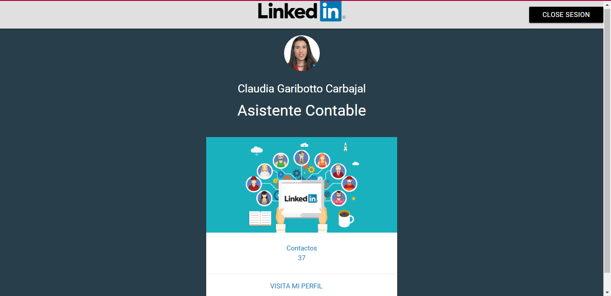

# LINKEDLN - La mayor red profesional del mundo

</img>

<a  href="https://travis-ci.org/t4t5/sweetalert"><a>

##  **OBJETIVO**

Crear una aplicación que nos permita ver nuestro perfil previamente con una autenticación.

## **Desarrollo**

Para el desarrollo de nuestra aplicacion se utilizo el api de Linkedln.

Nuestra aplicación te permite hacer una autenticaón 

El resultado da la consulta de tu perfil.

##  Tecnologias Usadas
- jquery
- javascript
- Html5
- Api de Linkedln
- Materialize

## Autores

- **Claudia Garibotto** - [@claudiagari](https://github.com/claudiagari)

- **Wendy Quispe** - [@wendytamara](https://github.com/wendytamara)

## Licencia

Este proyecto está licenciado bajo la Licencia ISC - ver el archivo [LICENSE](https://www.isc.org) para más detalles.

Copyright &copy; 2018 All Rights Reserved.
